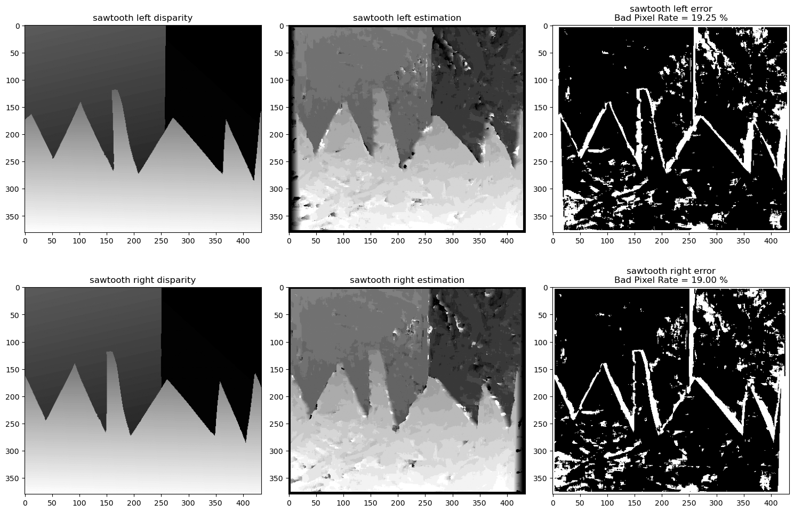
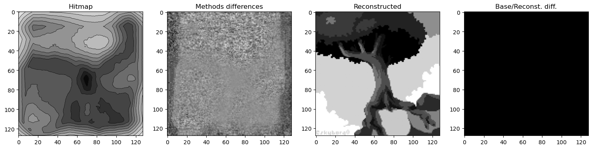
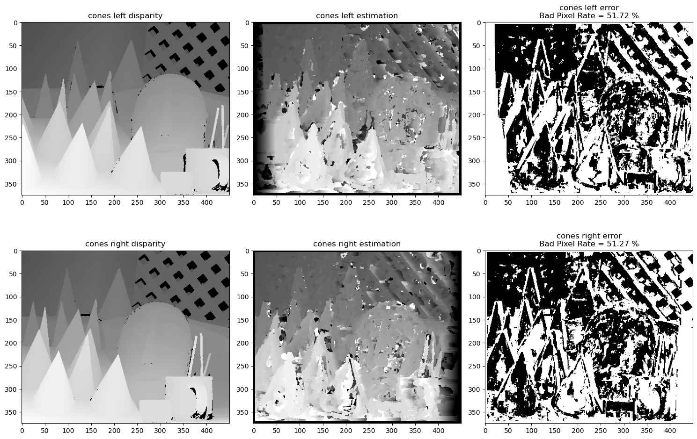

# Projet Vision par Ordinateur (VO)



## Sujet N°2 : Utilisation d’une variante 2D de la mesure de discordance de Weyl

**Rappel du sujet** :
La mise en correspondance de motif (pattern matching) est utilisée dans différentes applications de la vision par or-
dinateur comme la localisation d’objet dans une image, la stéréovision binoculaire, le suivi d’objet dans une séquence
d’images, la détection de défauts, etc. Elle repose sur l’utilisation d’une mesure de similarité ou de dissemblance.
Le travail demandé consiste à implémenter et à évaluer une mesure de dissemblance reposant sur la norme de
Weyl. Il s’agit d’une variante 2D discrète de la mesure de discordance (discrepancy measure) de Weyl. Son implémen-
tation repose sur l’utilisation des images intégrales (summed-area tables) et est décrite par les documents suivants :
- Christian M OTZ, Bernhard A. M OSER. On a Fast Implementation of a 2D-Variant of Weyl’s Discrepancy Measure.
OAGM and ARW Joint Workshop on Computer Vision and Robotics, 2016. https://cloud.irit.fr/s/VIhjP7wGhyrS5CC
Diaporama de présentation : https://cloud.irit.fr/s/t4eODwZKSbXtIX0
- Gabriele FACCIOLO, Nicolas L IMARE, Enric M EINHARDT. Integral Images for Block Matching. Image Processing
On Line, 4:344-369, 2014. https://cloud.irit.fr/s/qCQshAWznAk9gBK

**Données à disposition** :
- Suivi d’objets dans des séquences d’images :
    - recherche sur Google : object tracking dataset
    - ToCaDa : https://doi.org/10.5281/zenodo.1219420
    https://records.sigmm.org/2020/03/05/dataset-column-tocada-dataset-with-multi-viewpoint-synchronized-videos/
- Mise en correspondance dense de pixels pour la stéréovision binoculaire :
    - recherche sur Google : binocular stereo dataset
    - Middlebury Stereo Datasets : https://vision.middlebury.edu/stereo/data/

## Utilisation du dépôt

### Organisation du dépôt

Le projet est structuré selon l'arborescence suivante :
```
racine
  ├ datasets
  │   ├ test_images
  │   ├ pattern_recognition
  │   │   ├ 2001
  │   │   ├ 2003
  │   │   └ 2005
  │   └ object_tracking
  └ documents
      └ figures
```

Les notebooks, codes python et éventuels autres langages se trouvent à la racine du dépôt.

### Weyl Test - notebook

Ce notebook, nommé `Weyl_test.ipynb`, s'appuie sur les données du dossier _datasets/test_images_. Il permet de voir facilement un premier résultat et de comparer la méthode naïve à la méthode optimisée présentée dans le papier principal d'appui à ce projet.

Le résultat qui devrait être obtenu à la fin d'une exécution conforme de ce notebook ressemble à l'image ci-dessous.



### Mise en correspondance - notebook

Ce notebook, nommé `Dense_corresponding.ipynb`, s'appuie sur les données du dossier _datasets/pattern_recognition_. Ces données sont celles contenues dans les datasets **Middlebury** allant de 2001 à 2005. Le notebook permet de faire de la mise en correspondance dense de pixels en utilisant l'algorithme de Weyl.

Les résultats obtenus dans ce notebook devraient ressembler à l'image ci-dessous, dépendant des datasets que vous avez choisi de charger. Voici ce que vous pouvez espérer comme **BPR** (Bad Pixel Rate) avec les différents datasets :
- 2001 : environ 20 à 35% de BPR selon les images
- 2003 : environ 50 % de BPR sur les cônes
- 2005 : environ 80 % de BPR (Attention, très long à charger)

